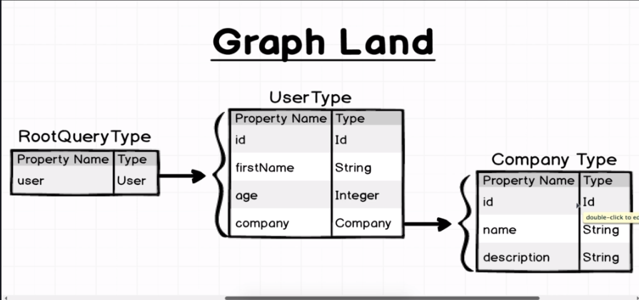

# Adding More Schemas and Cross Relation

## Adding More Schema

Data tables we keep on databases are generally related. When client queries an information, it may need to generate information from different tables. In this case, we have to define relationships between those tables and correlate each other.

As a first step, lets define another type called `company`

```js
// schema.js

/*...*/
const CompanyType = new GraphQLObjectType({
    name: "Company",
    fields: {
        id: {
            type: GraphQLString,
        },
        name: {
            type: GraphQLString,
        },
        description: {
            type: GraphQLString,
        },
    },
});
/*---*/


```

```json
// db.json

{
    "users":[
        {
            "id":"23",
            "firstName":"Bill",
            "age":20,
            "companyId":"1"
        },
        {
            "id":"40",
            "firstName":"Angelica",
            "age":55,
            "companyId":"1"
        },
        {
            "id":"41",
            "firstName":"Bill",
            "age":12,
            "companyId":"2"
        },
        {
            "id":"42",
            "firstName":"Mike",
            "age":5,
            "companyId":"3"
        },
        {
            "id":"43",
            "firstName":"Bob",
            "age":20,
            "companyId":"3"
        }
    ],

    "companies":[
        {"id":1, "name":"Apple","description":"Apple Inc."},
        {"id":2, "name":"Google","description":"Google Inc."},
        {"id":3, "name":"Meta","description":"Meta Inc."}
    ]
}
```

This line of codes defines type called `company`. And assume that each user is working on a company. In this case, we have to modify our user type to relate users with companies.

```js
// schema.js

/*---*/
const UserType = new GraphQLObjectType({
    name: 'User',
    fields:{
        id: {
            type: GraphQLString
        },
        firstName: {
            type: GraphQLString
        },
        age: {
            type: GraphQLInt
        },
        company: {
            type: CompanyType
        }
    }
})
/*---*/
```

The catch is here to define field company and its type to **CompanyType**.

Our database tables should look like this:

```js
/*
User Table                                  Company Table
---------------------                       -------------------------
id          |   string                      id          |  string
firstName   |   string                      name        |  string
age         |   number                      description |  string    
companyId   |   string
*/
```


As we can see from our figure above, our user model and user type has some differencies. In this case, we need to add resolve for any differencies.

Let's try to console log of our resolve function arguments:

```js
// schema.js

/*---*/

const UserType = GraphQLObjectType({
    name:'User',
    fields:{
        id:{
            type: GraphQLString
        },
        firstName: {
            type: GraphQLString
        },
        age: {
            type: GraphQLString
        },
        company: {
            type: CompanyType,
            resolve: async (parentValue, args) => {
                console.log(parentValue, args)
            }
        }
    }
})

/*---*/
```

When you query: 

```gql
{
    users(id: "23"){
        firstName,
        id,
        company {
            id
        }
    }
}
```

Console returns `{ id: '23', firstName: 'Bill', age: 20, companyId: '1' } {}`. So here, we can use field `companyId` and fetch our companies on this resolve function.

So overall solution should look like:

```js
// schema.js

/*---*/
const UserType = GraphQLObjectType({
    name:'User',
    fields:{
        id: {
            type: GraphQLString
        },
        firstName: {
            type: GraphQLString
        },
        age: {
            type: GraphQLInt
        },
        company: {
            type: CompanyType,
            resolve: async (parentValue,args) => {
                const companies = await axios.get(`http://localhost:3000/companies/${parentValue.companyId}`)
                return companies.data;
            }
        }
    }
})
/*---*/

```




It's also possible to add field to `RootQuery` to get companies directly.

```js
// schema.js

/*---*/

const RootQuery = GraphQLObjectType({
    name:'RootQuery',
    fields: {
        user: {
            type: GraphQLString,
            args:{ id: { type:GraphQLString } },
             resolve: async (parentValue, args) => {
                const users = await axios.get(
                    `http://localhost:3000/users/${args.id}`
                );
                return users.data;
            },
        },
         company: {
            type: CompanyType,
            args: { id: { type: GraphQLString } },
            resolve: async (parentValue, args) => {
                const company = await axios.get(
                    `http://localhost:3000/companies/${args.id}`
                );
                return company.data;
            },
        },
    }
})

module.exports = new GraphQLSchema({
    query: RootQuery
})
```

Now, we should be able to query companies direcyly.


There are lots of different operations that we can do. Each of them have different implementation so it's good idea to go through some of them. We can query companies with the users on belong them like we did for users.

```js
// schema.js

/*---*/
const CompanyType = new GraphQLObjectType({
    name: "Company",
    fields: {
        id: {
            type: GraphQLString,
        },
        name: {
            type: GraphQLString,
        },
        description: {
            type: GraphQLString,
        },
        users: {
            type: GraphQLList(UserType),
            resolve: async (parentValue, args) => {
                const users = await axios.get(
                    `http://localhost:3000/companies/${parentValue.id}/users`
                );

                return users.data;
            },
        },
    },
});
/*---*/
```

> Since we may have multiple user per company, we have used `GraphQLList` object type to indicate it is an array.

When you try to run our overall code, you should see an error.

```bash
type: GraphQLList(UserType),
ReferenceError: Cannot access 'UserType' before initialization
    at Object.<anonymous> (/prod/users/schema/schema.js:25:31)
```

This error is expected, because we try to assign variable UserType before initialize it. It's circular initialization problem.

To overcome this, GraphQL engineers have produced some workarounds. We need to wrap our field called `fields` into an anonymous function so that it will not get fired instantly, but will be fired when the all types are initialized. 

Overall schema.js should look like:

```js
//schema.js

const graphql = require("graphql");
const _ = require("lodash");
const axios = require("axios");
const {
    GraphQLObjectType,
    GraphQLString,
    GraphQLList,
    GraphQLInt,
    GraphQLSchema,
} = graphql;

const CompanyType = new GraphQLObjectType({
    name: "Company",
    fields: () => ({
        id: {
            type: GraphQLString,
        },
        name: {
            type: GraphQLString,
        },
        description: {
            type: GraphQLString,
        },
        users: {
            type: GraphQLList(UserType),
            resolve: async (parentValue, args) => {
                const users = await axios.get(
                    `http://localhost:3000/companies/${parentValue.id}/users`
                );

                return users.data;
            },
        },
    }),
});

const UserType = new GraphQLObjectType({
    name: "User",
    fields: () => ({
        id: {
            type: GraphQLString,
        },
        firstName: {
            type: GraphQLString,
        },
        age: { type: GraphQLInt },
        company: {
            type: CompanyType,
            resolve: async (parentValue, args) => {
                const company = await axios.get(
                    `http://localhost:3000/companies/${parentValue.companyId}`
                );
                return company.data;
            },
        },
    }),
});

const RootQuery = new GraphQLObjectType({
    name: "RootQueryType",
    fields: {
        user: {
            type: UserType,
            args: { id: { type: GraphQLString } },
            resolve: async (parentValue, args) => {
                const users = await axios.get(
                    `http://localhost:3000/users/${args.id}`
                );

                return users.data;
            },
        },
        company: {
            type: CompanyType,
            args: { id: { type: GraphQLString } },
            resolve: async (parentValue, args) => {
                const company = await axios.get(
                    `http://localhost:3000/companies/${args.id}`
                );
                return company.data;
            },
        },
    },
});

module.exports = new GraphQLSchema({
    query: RootQuery,
});

```
