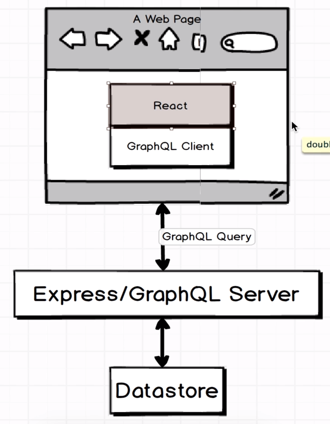
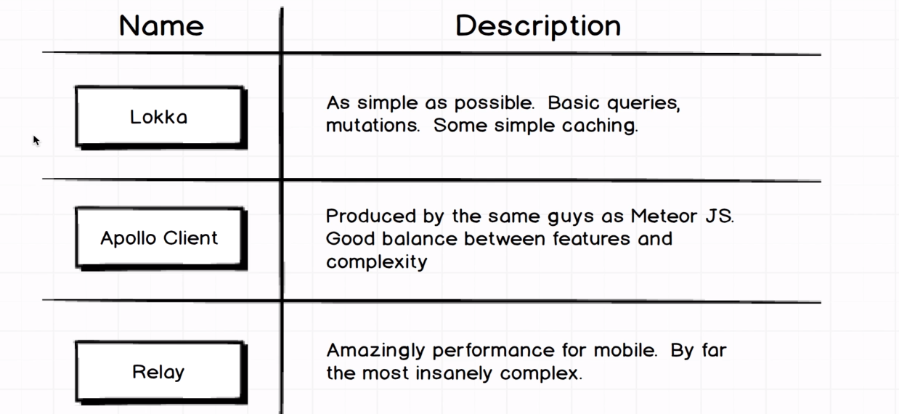
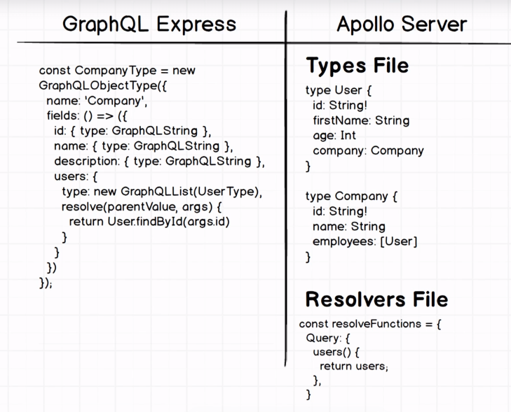
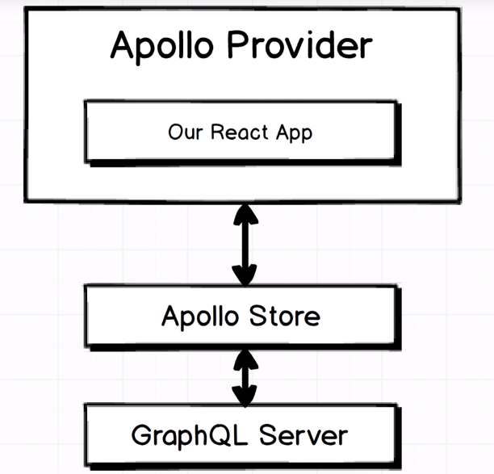
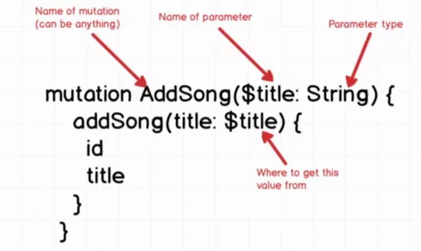
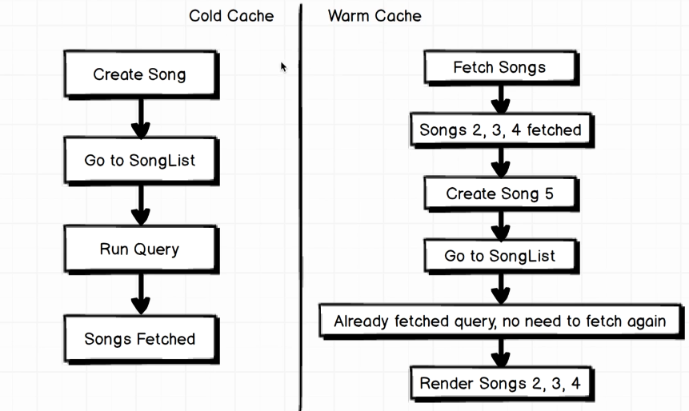

# GraphQL Clients

So far we've worked on backend side of GraphQL. We've executed our queries by using GrahpiQL. In real world, we need to transport our query results to frontend side to make them usable for production environment. That is where we need to use GraphQL Clients.

The main architecture of how it works is shown below:



There are several alternatives that we may use as a GraphQL client. Some of them:



We'll move with Apollo Client. Apollo also has backend server for GraphQL. (remember we've used express-graphql)



## Connecting Apollo Client

Our structure will look like



In between our react application and GraphQL server, we have 2 big structure, Apollo Store and Apollo Provider.

Apollo Store is a store that exists on client side that manages the data coming from GraphQL Server. Apollo Store is an abstract structure that is agnostic to frontend framework.

Apollo Provider provides the data from the store and inject into react application. It works as a glue.

Setuping Apollo Store is short, we generally will work on Apollo Provider.

We will define a client and wrap our react app with provider.

```jsx
//client/index.js
import React from "react";
import ReactDOM from "react-dom";
import { ApolloClient, InMemoryCache, ApolloProvider } from "@apollo/client";

const client = new ApolloClient({
    cache: new InMemoryCache(),
    uri: "http://localhost:4000/graphql",
});

const Root = () => {
    return (
        <ApolloProvider client={client}>
          <div>Lyrical</div>
        </ApolloProvider>
    );
};

ReactDOM.render(<Root />, document.querySelector("#root"));
```

From now on, any component wrapped in `ApolloProvider` can react GraphQL sources.

### Creating First Component and Fetch Data

Let's create a component `SongList` that fetches songs and lists inside itself. It's so easy to write query and execute in the component. All we need to use `useQuery` hook and `gql` funtion that Apollo Client serves us.

```jsx
import React from "react";
import { gql, useQuery } from "@apollo/client";

const GET_SONGS = gql`
    query GetSongs {
        songs {
            title
        }
    }
`;

const SongList = () => {
    const { loading, error, data } = useQuery(GET_SONGS);

    if (loading) return "Loading...";
    if (error) return `Error! ${error.message}`;

    return (
        <ul>
            {data.songs.map((el) => (
                <li key={el.title}>{el.title}</li>
            ))}
        </ul>
    );
};

export default SongList;
```

> In case of any error, you should check your console everytime. Error codes and their definitions are placed in `node_modules/@apollo/client/invariantErrorCodes.js`

Before moving on, lets add routes to our project, we will need them on next parts. Import necessary functions from `react-router` and edit `index.js` as follows:

```js
import React from "react";
import ReactDOM from "react-dom";
import { ApolloClient, InMemoryCache, ApolloProvider } from "@apollo/client";
import SongList from "./components/songlist";
import {
    createBrowseouter,
    createHashRouter,
    RouterProvider,
} from "react-router-dom";

const client = new ApolloClient({
    cache: new InMemoryCache(),
    uri: "http://localhost:4000/graphql",
});

const router = createHashRouter([
    {
        path: "/",
        element: <SongList />,
    },
]);

const Root = () => {
    return (
        <ApolloProvider client={client}>
            <RouterProvider router={router} />
        </ApolloProvider>
    );
};

ReactDOM.render(<Root />, document.querySelector("#root"));

```


## Caching on Apollo

Whenever Apollo Client fetches query results from server, it automatically *caches* those results locally. This makes later executions of that same query extremely fast. Codes on this section are for references, they are not used in our system.

### Polling

Polling provides near-real-time synchronization with your server by executing your query periodically at a specified interval. To enable polling for a query, pass a pollInterval configuration option to the useQuery hook with an interval in milliseconds. As an example:

```jsx
const { loading, error, data } = useQuery   (GET_DOG_PHOTO, {
  variables: { breed },
  pollInterval: 500,
});

```

By setting pollInterval to `500`, we fetch the current breed's image from the server every 0.5 seconds. Note that if you set pollInterval to `0`, the query does not poll.

### Refetching

In order to force refetching, we can use `refetch` method that useQuery serves us.

```jsx
const { loading, error, data, refetch } = useQuery(GET_DOG_PHOTO, {
    variables: { breed },
});
/*--*/
<button onClick={() => refetch({ breed: 'new_dog_breed' })}>
    Refetch new breed!
</button>
```

## Mutation

Operating mutations is similar to queries. We use `useMutation` hook this time. Let's create a new component `SongCreate` to create new songs. In our component, if our gql component is `ADD_SONG` and function to add song is `addSong`, then the hook call should look like:

```jsx
const [addSong, { data, loading, error }] = useMutation(ADD_SONG);
```

### Passing Variables to GQL and Add Operation

Before moving on our component, it is important to know how to pass variable to our gql query.

We need to define our variable and its type on query definition, then we can call it inside our query. Variables are called with prefix `$`. And we add `!` at the end of type declaration if the variable is must.



To add new song, we'll use `addSong` endpoint, so it will look like:

```gql
mutation AddSong($title:String!){
    addSong(title:$title){
        title
    }
}
```
So our `SongCreate` component should look like:

```jsx
import React, { useState } from "react";
import { gql, useMutation } from "@apollo/client";

const ADD_SONG = gql`
    mutation AddSong($title: String!) {
        addSong(title: $title) {
            title
        }
    }
`;

const SongCreate = () => {
    const [name, setName] = useState("");
    const [addSong, { data, loading, error }] = useMutation(ADD_SONG);

    if (loading) return "Submitting...";
    if (error) return `Submission error! ${error.message}`;

    return (
        <div>
            <h3>Create a new song</h3>
            <form
                onSubmit={(event) => {
                    event.preventDefault();
                    addSong({
                        variables: {
                            title: name,
                        },
                    });
                }}
            >
                <label htmlFor="title">Song Title:</label>
                <input
                    id="title"
                    placeholder="Enter Song Name"
                    value={name}
                    onChange={(e) => setName(e.target.value)}
                />
                <button type="submit">Create a new song</button>
            </form>
        </div>
    );
};

export default SongCreate;
```

And, add `SongCreate` component to */create* endpoint.

```js
import React from "react";
import ReactDOM from "react-dom";
import { ApolloClient, InMemoryCache, ApolloProvider } from "@apollo/client";
import SongList from "./components/songlist";
import SongCreate from "./components/songcreate";
import {
    createBrowseouter,
    createHashRouter,
    RouterProvider,
} from "react-router-dom";

const client = new ApolloClient({
    cache: new InMemoryCache(),
    uri: "http://localhost:4000/graphql",
});

const router = createHashRouter([
    {
        path: "/",
        element: <SongList />,
    },
    {
        path: "/create",
        element: <SongCreate />,
    },
]);

const Root = () => {
    return (
        <ApolloProvider client={client}>
            <RouterProvider router={router} />
        </ApolloProvider>
    );
};

ReactDOM.render(<Root />, document.querySelector("#root"));
```

> Notice that we've used `HashRouter`. So, in order to react `SongCreate` component, we should navigate to *http://localhost:4000/#/create*.


As a side note, remember that we are using `GraphiQL`. So it's also possible to operate mutation operations on `localhost:4000/graphql` page.

To add a variable, we have to click bottom left (*Query Variables*) section and add our variables as **JSON** format. Example:

```json
{
  "title": "GraphQL Song"
}
```

> mutation methods are asynchronous, which you can use .then/.catch or async/await methods to run functions whenever they are done.

Lets navigate to homepage whenever we add a new song, all we need to do is edit our `onSubmit` method

```jsx
//songcreate.jsx
 <form
    onSubmit={async (event) => {
        event.preventDefault();
        await addSong({
            variables: {
                title: name,
            },
        });
        navigate("/");
    }}
>
```

There is an issue that we have to consider now. When we refresh page on `localhost:4000/#/create` and create a new song and hit create button, our new song will be listed on `SongList` component. But when we refresh page on `localhost:4000/` and run through creating new songs, the newly created song won't be shown on our page.



We have to rerun the query after mutation is completed. To do this, all we need to do is change `mutation` method call.

```jsx
<form
    onSubmit={async (event) => {
        event.preventDefault();
        await addSong({
            variables: {
                title: name,
            },
            refetchQueries: [{ query: GET_SONGS, variables: {} }],
        });
        navigate("/");
    }}
>
```

`GET_SONGS` is the query that we've defined on `SongList` component. Make sure to export it before using.

> As a convention, we generally create different files for query and mutate operations, and import them whenever needed.
>
> So move your queries to /client/queries, and mutations to /client/mutations folders.
> As a result, we'll have 2 different files, `addSong.js` and `fetchSong.js`


```js
//fetchSong.js
import { gql } from "@apollo/client";

const GET_SONGS = gql`
    query GetSongs {
        songs {
            title
        }
    }
`;

export default GET_SONGS;


/*--*/
//addSong.js
import { gql } from "@apollo/client";

const ADD_SONG = gql`
    mutation AddSong($title: String!) {
        addSong(title: $title) {
            title
        }
    }
`;

export default ADD_SONG;
```


## Delete Operation

To delete records, we need to use `deleteSong` endpoint.

```gql
mutation DeleteSong($id:ID!) {
  deleteSong(id:$id) {
    title
    id
  }
}
```

Lets add the mutation under mutation folder.

```js
//mutations/deleteSong.js
import { gql } from "@apollo/client";

const DELETE_SONG = gql`
    mutation DeleteSong($id: ID!) {
        deleteSong(id: $id) {
            title
            id
        }
    }
`;

export default DELETE_SONG;
```

So overall `SongList` component should look like:

```jsx
import React from "react";
import { useMutation, useQuery } from "@apollo/client";
import { Link } from "react-router-dom";
import GET_SONGS from "../queries/fetchSongs";
import DELETE_SONG from "../mutations/deleteSong";

const SongList = () => {
    const { loading, error, data } = useQuery(GET_SONGS);
    const [deleteSong] = useMutation(DELETE_SONG);

    if (loading) return "Loading...";
    if (error) return `Error! ${error.message}`;

    return (
        <div>
            <ul>
                {data.songs.map((el) => (
                    <li
                        key={el.title}
                        style={{
                            display: "flex",
                            alignItems: "center",
                        }}
                    >
                        <p style={{ marginRight: 2 }}>{el.title}</p>
                        <button
                            onClick={() =>
                                deleteSong({
                                    variables: { id: el.id },
                                    refetchQueries: [{ query: GET_SONGS }],
                                })
                            }
                        >
                            X
                        </button>
                    </li>
                ))}
            </ul>
            <Link to="/create">Create a new song</Link>
        </div>
    );
};

export default SongList;
```

Another way to operate delete operation successfully is to use `refetch` method. We are able to use this method because we're already fetching data with `useQuery` in the same particular component. So instead of use `refetchQueries`, we are able to get data with the following code:

```jsx
import React from "react";
import { useMutation, useQuery } from "@apollo/client";
import { Link } from "react-router-dom";
import GET_SONGS from "../queries/fetchSongs";
import DELETE_SONG from "../mutations/deleteSong";

const SongList = () => {
    const { loading, error, data, refetch } = useQuery(GET_SONGS);
    const [deleteSong] = useMutation(DELETE_SONG);

    if (loading) return "Loading...";
    if (error) return `Error! ${error.message}`;

    return (
        <div>
            <ul>
                {data.songs.map((el) => (
                    <li
                        key={el.title}
                        style={{
                            display: "flex",
                            alignItems: "center",
                        }}
                    >
                        <p style={{ marginRight: 2 }}>{el.title}</p>
                        <button
                            onClick={async () => {
                                await deleteSong({
                                    variables: { id: el.id },
                                });
                                await refetch();
                            }}
                        >
                            X
                        </button>
                    </li>
                ))}
            </ul>
            <Link to="/create">Create a new song</Link>
        </div>
    );
};

export default SongList;
```


## Cache Updating

Mutation operations changes the data on the backend and they requires some mechanisms to reflect that change to frontend. So far, we've used `refetch` method on useQuery and `refetchQueries` options that useMutation serves.

Both of those approaches requires another http call to the backend. That means, for a little small change of our data, we fetch the related data completely. By doing this we double the http call we make and rewrite the data that is already the same.

On that step, we can work on updating cache without fetching the whole query. There are different methods for this operation.

### Using dataIdFromObject to Normalize State

Apollo Client serves us a configuration option which called as `dataIdFromObject`. `dataIdFromObject` option normalizes the state with its given option. For our case, all of our records have `id` field. So we can use this field to normalize our state in store.

Configuration is simple, all we need to do is add the following:

```js
//index.js

/*---*/
const client = new ApolloClient({
    cache: new InMemoryCache({ dataIdFromObject: (o) => o.id }),
    uri: "http://localhost:4000/graphql",
});
/*---*/

```

By adding this option to Apollo Client, we have normalized all store entities that we've or we'll fetched. Entities that is fetched by using queries will be automatically updated after mutations now.

To demonstrate you, we can add a unique page for each song. We'll reach the pages by `localhost:4000/#/song/:id`. Let's add component `SongDetail`. (On this point, I will directly add the whole component, since we've worked each parts before)

```jsx
import React, { useState } from "react";
import { useMutation, useQuery } from "@apollo/client";
import GET_SONG from "../queries/fetchSong";
import ADD_LYRICS from "../mutations/addLyrics";
import LIKE_LYRIC from "../mutations/likeLyric";
import { Link, useParams } from "react-router-dom";

const SongDetail = () => {
    const params = useParams();
    const { id } = params;
    const { data, error, loading, refetch } = useQuery(GET_SONG, {
        variables: { id },
    });
    const [addLyric] = useMutation(ADD_LYRICS);
    const [likeLyric] = useMutation(LIKE_LYRIC);
    const [text, setText] = useState("");

    if (loading) return <div>Loading...</div>;
    if (error) return <div>Error!</div>;

    const likeLyricHandler = async (id) => {
        await likeLyric({ variables: { id } });
        await refetch();
    };

    return (
        <div>
            <Link to="/">Back home</Link>
            <h3>Song Details</h3>
            <div>
                <h4>name: {data.song.title}</h4>
                <div>
                    <h5>Lyrics:</h5>
                    {data.song.lyrics.map((el) => (
                        <div
                            key={el.id}
                            style={{ marginLeft: 20 }}
                            style={{
                                display: "grid",
                                gridTemplateColumns: "30rem 10rem",
                            }}
                        >
                            <span style={{ marginRight: 20 }}>
                                {el.content}
                            </span>
                            <div>
                                <span style={{ marginRight: 2 }}>
                                    Likes: {el.likes}
                                </span>
                                <button onClick={() => likeLyricHandler(el.id)}>
                                    Like Now
                                </button>
                            </div>
                        </div>
                    ))}
                </div>
                <form
                    onSubmit={async () => {
                        await addLyric({
                            variables: { content: text, songId: id },
                        });
                    }}
                    style={{ display: "flex", alignItems: "center" }}
                >
                    <div style={{ display: "flex", flexDirection: "column" }}>
                        <label htmlFor="lyric">Add new Lyric</label>
                        <input
                            id="lyric"
                            onChange={(e) => setText(e.target.value)}
                            value={text}
                            placeholder="Enter Lyrics"
                            style={{ width: "15rem" }}
                        />
                    </div>

                    <button type="submit">Add</button>
                </form>
            </div>
        </div>
    );
};

export default SongDetail;
```

And, edit Router on `index.js`:

```jsx
import React from "react";
import ReactDOM from "react-dom";
import { ApolloClient, InMemoryCache, ApolloProvider } from "@apollo/client";
import SongList from "./components/songlist";
import SongCreate from "./components/songcreate";
import {
    createBrowseouter,
    createHashRouter,
    RouterProvider,
} from "react-router-dom";
import SongDetail from "./components/songdetail";

const client = new ApolloClient({
    cache: new InMemoryCache({ dataIdFromObject: (o) => o.id }),
    uri: "http://localhost:4000/graphql",
});

const router = createHashRouter([
    {
        path: "/",
        element: <SongList />,
    },
    {
        path: "/create",
        element: <SongCreate />,
    },
    { path: "/song/:id", element: <SongDetail /> },
]);

const Root = () => {
    return (
        <ApolloProvider client={client}>
            <RouterProvider router={router} />
        </ApolloProvider>
    );
};

ReactDOM.render(<Root />, document.querySelector("#root"));
```

And queries & mutations:

```js
//mutations/addLyrics.js
import { gql } from "@apollo/client";

const ADD_LYRICS = gql`
    mutation AddLyrics($content: String, $songId: ID) {
        addLyricToSong(content: $content, songId: $songId) {
            title
            id
            lyrics {
                content
                id
            }
        }
    }
`;

export default ADD_LYRICS;

//mutations/likeLyric.js
import { gql } from "@apollo/client";

const LIKE_LYRIC = gql`
    mutation LikeLyric($id: ID) {
        likeLyric(id: $id) {
            id
        }
    }
`;

export default LIKE_LYRIC;

//queries/fetchSong.js
import { gql } from "@apollo/client";

const GET_SONG = gql`
    query GetSong($id: ID!) {
        song(id: $id) {
            id
            title
            lyrics {
                id
                likes
                content
            }
        }
    }
`;
export default GET_SONG;

```

Before moving on, we should understand the logic behind `dataIdFromObject`. What we need to focus are the queries that have been made on the app. We've fetched the data from those two endpoints:

```
songs: [SongType]
song(id: ID!): SongType

// whereas
SongType: {
    id: ID
    title: String
    lyrics: [LyricType]
}

```

So `dataIdFromObject` have normalized entities that have type `SongType` based on their `id`s. Now when we add new lyrics to the song, we do not need to run query, Apollo Client detects the change on entity and updates its cache. But when we like a song, we have to run refetch because on Apollo Store we do not have specific informations about lyrics. This is very important to understand.

Similarly, we can remove `refetchOnQueries` option on `SongCreate` component, we do not need it anymore.

```jsx
//songcreate.jsx
import React, { useState } from "react";
import { useMutation } from "@apollo/client";
import { Link, useNavigate } from "react-router-dom";
import GET_SONGS from "../queries/fetchSongs";
import ADD_SONG from "../mutations/addSong";

const SongCreate = () => {
    const [name, setName] = useState("");
    const [addSong, { data, loading, error }] = useMutation(ADD_SONG);
    const navigate = useNavigate();

    if (loading) return "Submitting...";
    if (error) return `Submission error! ${error.message}`;

    return (
        <div>
            <Link to="/">Back</Link>
            <h3>Create a new song</h3>
            <form
                onSubmit={async (event) => {
                    event.preventDefault();
                    await addSong({
                        variables: {
                            title: name,
                        },
                        //refetchQueries: [{ query: GET_SONGS, variables: {} }],
                    });
                    navigate("/");
                }}
            >
                <label htmlFor="title">Song Title:</label>
                <input
                    id="title"
                    placeholder="Enter Song Name"
                    value={name}
                    onChange={(e) => setName(e.target.value)}
                />
                <button type="submit">Create a new song</button>
            </form>
        </div>
    );
};

export default SongCreate;

```