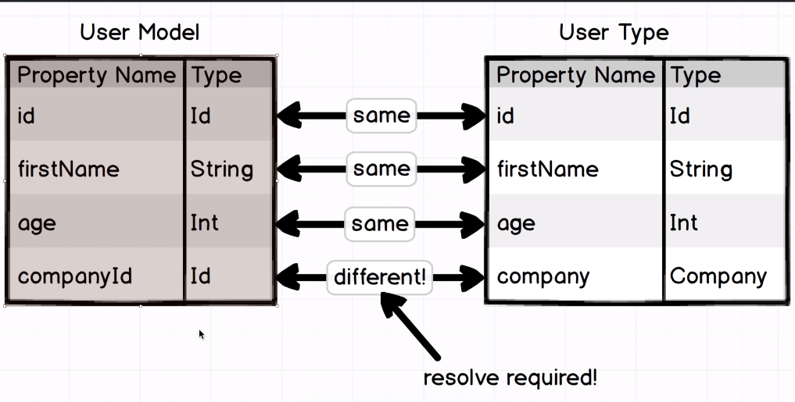
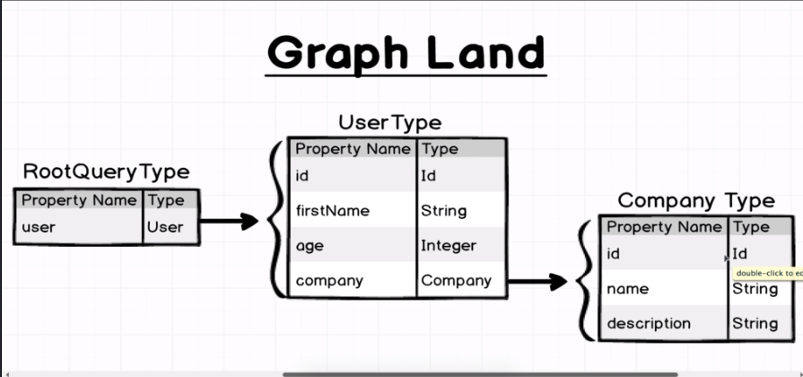

# GraphQL Course

Shortcomings of RESTful routings:

-	When we need specific data, the nested structure of RESTful APIs getting more and more complex. 
-	On highly related data, using of RESTful APIs may harm our software, since we have to make lots of calls.
-	We fetch all the data from the backend although we do not need them. RESTful APIs may serve dramatically heavy data.


GraphQL does not change the way that we store data. It only deals with the data send to the client.

An example query:

```gql
query {
	users(id: "23"){
		friends{
			id
			name
			company{
				name
			}
			position{
				name
			}
		}
	}
}
```

Packages that we need to install:

`npm i express express-graphql graphql lodash --save`

## Basic configuration

```js
const express = require("express");
const expressGraphQL = require("express-graphql").graphqlHTTP;

const app = express();
app.use(
    "/graphql",
    expressGraphQL({
        graphiql: true,
    })
);

app.listen("4000", () => {
    console.log("Listening port 4000");
});
```

> GraphiQL is the reference implementation of this monorepo, GraphQL IDE, an official project under the GraphQL Foundation. Graphiql is a development tool to train developers to use GraphQL.

We must define & use a schema to use GraphQL. Lets start with basic schema definition.

### Schema Definition

```js
// schema/schema.js

const graphql = require("graphql");

const { GraphQLObjectType, GraphQLString, GraphQLInt } = graphql;

const UserType = new GraphQLObjectType({
    name: "User",
    fields: {
        id: {
            type: GraphQLString,
        },
        firstName: {
            type: GraphQLString,
        },
        age: { type: GraphQLInt },
    },
});

```

### Root Query Definition

To use GraphQL in our application, we have to define Root Query. Root Query is the entry point of GraphQL API.

```js
const RootQuery = new GraphQLObjectType({
    name: "RootQueryType",
    fields: {
        user: {
            type: UserType,
            args: { id: { type: GraphQLString } },
            resolve(parentValue, args) {
                // the way we gather data from DB
                // the most important field of RootQuery
            },
        },
    },
});
```

At first step, let's use static data, and fill resolve function. Don't forget to create Schema and export it.

```js
// schema.js

const graphql = require("graphql");
const _ = require("lodash");
const { GraphQLObjectType, GraphQLString, GraphQLInt, GraphQLSchema } = graphql;

const users = [
    {
        id: "23",
        firstName: "Bill",
        age: 20,
    },
    {
        id: "47",
        firstName: "Samantha",
        age: 21,
    },
];

const UserType = new GraphQLObjectType({
    name: "User",
    fields: {
        id: {
            type: GraphQLString,
        },
        firstName: {
            type: GraphQLString,
        },
        age: { type: GraphQLInt },
    },
});

const RootQuery = new GraphQLObjectType({
    name: "RootQueryType",
    fields: {
        user: {
            type: UserType,
            args: { id: { type: GraphQLString } },
            resolve(parentValue, args) {
                const { id } = args;
                return _.find(users, { id });
            },
        },
    },
});

module.exports = new GraphQLSchema({
    query: RootQuery,
});

```


```js
// server.js

const express = require("express");
const expressGraphQL = require("express-graphql").graphqlHTTP;
const schema = require("./schema/schema");

const app = express();
app.use(
    "/graphql",
    expressGraphQL({
        schema,
        graphiql: true,
    })
);

app.listen("4000", () => {
    console.log("Listening port 4000");
});

```

We're ready to try our query now. Now enter `localhost:4000/graphql` and you'll see graphiql UI that you can enter your queries.

## Configration with Non-Hardcoded Data

Let's add dynamic data instead of hard-coded one. It's possible to deploy our own database or use 3rd party databases or APIs.

Let's start with `json server`.

Installation:

```bash
npm i json-server
```

Create a file called `db.json` 

```json
{
    "users":[
        {
            "id":"23",
            "firstName":"Bill",
            "age":20
        },
        {
            "id":"40",
            "firstName":"Angelica",
            "age":55
        },
        {
            "id":"41",
            "firstName":"Bill",
            "age":12
        },
        {
            "id":"42",
            "firstName":"Mike",
            "age":5
        },
        {
            "id":"43",
            "firstName":"Bob",
            "age":20
        }
    ]
}
```

add `"json:server": "json-server --watch db.json" ` to package.json's script field.

> Before moving on, lets install nodemon aswell `npm i nodemon --save-dev` and add following script `"graphql:server": "nodemon ./server.js` to package.json. It'll automatically restart our server when we make changes.

Next step is to run our fake json server by typing `npm run json:server`. Open browser and go to `localhost:3000/users`. You should see our user list.

Now, we can connect our fake server to GraphQL structure. To get data from our fake server, we need to make http calls. We can do it either by using `fetch` or package `axios`. I generally prefer axios. To install type following command to terminal `npm i axios`. And format your resolve function and delete your hard-coded data.

```js
//schema.js

const graphql = require("graphql");
const _ = require("lodash");
const axios = require("axios");
const { GraphQLObjectType, GraphQLString, GraphQLInt, GraphQLSchema } = graphql;

const UserType = new GraphQLObjectType({
    name: "User",
    fields: {
        id: {
            type: GraphQLString,
        },
        firstName: {
            type: GraphQLString,
        },
        age: { type: GraphQLInt },
    },
});

const RootQuery = new GraphQLObjectType({
    name: "RootQueryType",
    fields: {
        user: {
            type: UserType,
            args: { id: { type: GraphQLString } },
            resolve: async (parentValue, args) => {
                const users = await axios.get(
                    `http://localhost:3000/users/${args.id}`
                );
                return users.data;
            },
        },
    },
});

module.exports = new GraphQLSchema({
    query: RootQuery,
});
```

## Adding More Schema

Data tables we keep on databases are generally related. When client queries an information, it may need to generate information from different tables. In this case, we have to define relationships between those tables and correlate each other.

As a first step, lets define another type called `company`

```js
// schema.js

/*...*/
const CompanyType = new GraphQLObjectType({
    name: "Company",
    fields: {
        id: {
            type: GraphQLString,
        },
        name: {
            type: GraphQLString,
        },
        description: {
            type: GraphQLString,
        },
    },
});
/*---*/


```

```json
// db.json

{
    "users":[
        {
            "id":"23",
            "firstName":"Bill",
            "age":20,
            "companyId":"1"
        },
        {
            "id":"40",
            "firstName":"Angelica",
            "age":55,
            "companyId":"1"
        },
        {
            "id":"41",
            "firstName":"Bill",
            "age":12,
            "companyId":"2"
        },
        {
            "id":"42",
            "firstName":"Mike",
            "age":5,
            "companyId":"3"
        },
        {
            "id":"43",
            "firstName":"Bob",
            "age":20,
            "companyId":"3"
        }
    ],

    "companies":[
        {"id":1, "name":"Apple","description":"Apple Inc."},
        {"id":2, "name":"Google","description":"Google Inc."},
        {"id":3, "name":"Meta","description":"Meta Inc."}
    ]
}
```

This line of codes defines type called `company`. And assume that each user is working on a company. In this case, we have to modify our user type to relate users with companies.

```js
// schema.js

/*---*/
const UserType = new GraphQLObjectType({
    name: 'User',
    fields:{
        id: {
            type: GraphQLString
        },
        firstName: {
            type: GraphQLString
        },
        age: {
            type: GraphQLInt
        },
        company: {
            type: CompanyType
        }
    }
})
/*---*/
```

The catch is here to define field company and its type to **CompanyType**.

Our database tables should look like this:

```js
/*
User Table                                  Company Table
---------------------                       -------------------------
id          |   string                      id          |  string
firstName   |   string                      name        |  string
age         |   number                      description |  string    
companyId   |   string
*/
```



As we can see from our figure above, our user model and user type has some differencies. In this case, we need to add resolve for any differencies.

Let's try to console log of our resolve function arguments:

```js
// schema.js

/*---*/

const UserType = GraphQLObjectType({
    name:'User',
    fields:{
        id:{
            type: GraphQLString
        },
        firstName: {
            type: GraphQLString
        },
        age: {
            type: GraphQLString
        },
        company: {
            type: CompanyType,
            resolve: async (parentValue, args) => {
                console.log(parentValue, args)
            }
        }
    }
})

/*---*/
```

When you query: 

```gql
{
    users(id: "23"){
        firstName,
        id,
        company {
            id
        }
    }
}
```

Console returns `{ id: '23', firstName: 'Bill', age: 20, companyId: '1' } {}`. So here, we can use field `companyId` and fetch our companies on this resolve function.

So overall solution should look like:

```js
// schema.js

/*---*/
const UserType = GraphQLObjectType({
    name:'User',
    fields:{
        id: {
            type: GraphQLString
        },
        firstName: {
            type: GraphQLString
        },
        age: {
            type: GraphQLInt
        },
        company: {
            type: CompanyType,
            resolve: async (parentValue,args) => {
                const companies = await axios.get(`http://localhost:3000/companies/${parentValue.companyId}`)
                return companies.data;
            }
        }
    }
})
/*---*/

```




It's also possible to add field to `RootQuery` to get companies directly.

```js
// schema.js

/*---*/

const RootQuery = GraphQLObjectType({
    name:'RootQuery',
    fields: {
        user: {
            type: GraphQLString,
            args:{ id: { type:GraphQLString } },
             resolve: async (parentValue, args) => {
                const users = await axios.get(
                    `http://localhost:3000/users/${args.id}`
                );
                return users.data;
            },
        },
         company: {
            type: CompanyType,
            args: { id: { type: GraphQLString } },
            resolve: async (parentValue, args) => {
                const company = await axios.get(
                    `http://localhost:3000/companies/${args.id}`
                );
                return company.data;
            },
        },
    }
})

module.exports = new GraphQLSchema({
    query: RootQuery
})
```

Now, we should be able to query companies direcyly.


There are lots of different operations that we can do. Each of them have different implementation so it's good idea to go through some of them. We can query companies with the users on belong them like we did for users.

```js
// schema.js

/*---*/
const CompanyType = new GraphQLObjectType({
    name: "Company",
    fields: {
        id: {
            type: GraphQLString,
        },
        name: {
            type: GraphQLString,
        },
        description: {
            type: GraphQLString,
        },
        users: {
            type: GraphQLList(UserType),
            resolve: async (parentValue, args) => {
                const users = await axios.get(
                    `http://localhost:3000/companies/${parentValue.id}/users`
                );

                return users.data;
            },
        },
    },
});
/*---*/
```

> Since we may have multiple user per company, we have used `GraphQLList` object type to indicate it is an array.

When you try to run our overall code, you should see an error.

```bash
type: GraphQLList(UserType),
                              ^

ReferenceError: Cannot access 'UserType' before initialization
    at Object.<anonymous> (/prod/users/schema/schema.js:25:31)
```

This error is expected, because we try to assign variable UserType before initialize it. It's circular initialization problem.

To overcome this, GraphQL engineers have produced some workarounds. We need to wrap our field called `fields` into an anonymous function so that it will not get fired instantly, but will be fired when the all types are initialized. 

Overall schema.js should look like:

```js
//schema.js

const graphql = require("graphql");
const _ = require("lodash");
const axios = require("axios");
const {
    GraphQLObjectType,
    GraphQLString,
    GraphQLList,
    GraphQLInt,
    GraphQLSchema,
} = graphql;

const CompanyType = new GraphQLObjectType({
    name: "Company",
    fields: () => ({
        id: {
            type: GraphQLString,
        },
        name: {
            type: GraphQLString,
        },
        description: {
            type: GraphQLString,
        },
        users: {
            type: GraphQLList(UserType),
            resolve: async (parentValue, args) => {
                const users = await axios.get(
                    `http://localhost:3000/companies/${parentValue.id}/users`
                );

                return users.data;
            },
        },
    }),
});

const UserType = new GraphQLObjectType({
    name: "User",
    fields: () => ({
        id: {
            type: GraphQLString,
        },
        firstName: {
            type: GraphQLString,
        },
        age: { type: GraphQLInt },
        company: {
            type: CompanyType,
            resolve: async (parentValue, args) => {
                const company = await axios.get(
                    `http://localhost:3000/companies/${parentValue.companyId}`
                );
                return company.data;
            },
        },
    }),
});

const RootQuery = new GraphQLObjectType({
    name: "RootQueryType",
    fields: {
        user: {
            type: UserType,
            args: { id: { type: GraphQLString } },
            resolve: async (parentValue, args) => {
                const users = await axios.get(
                    `http://localhost:3000/users/${args.id}`
                );

                return users.data;
            },
        },
        company: {
            type: CompanyType,
            args: { id: { type: GraphQLString } },
            resolve: async (parentValue, args) => {
                const company = await axios.get(
                    `http://localhost:3000/companies/${args.id}`
                );
                return company.data;
            },
        },
    },
});

module.exports = new GraphQLSchema({
    query: RootQuery,
});

```


## Tips on Query Writing

So far, we've generally worked on backend. It's good time to talk about some tips about writing queries.

### Defining Fragments

To prevent repetitive parts on queries, it is possible to write fragments to use later on. 

```gql
fragment CompanyDetails on Company {
  name
  description
  id
  users {
    id
    age
  }
}

{
  company(id: "1") {
    ...CompanyDetails
  }
}
```

### Defining Aliases

It is also possible to define aliases to modify responses as you wish to handle data more efficiently.

```gql
{
  apple: company(id: "1") {
    ...CompanyDetails
  }
  google: company(id: "2") {
    ...CompanyDetails
  }
}

fragment CompanyDetails on Company {
  name
  description
  id
  users {
    id
    age
  }
}
```

```json
//result 

{
  "data": {
    "apple": {
      "name": "Apple",
      "description": "Apple Inc.",
      "id": "1",
      "users": [
        {
          "id": "23",
          "age": 20
        },
        {
          "id": "40",
          "age": 55
        }
      ]
    },
    "google": {
      "name": "Google",
      "description": "Google Inc.",
      "id": "2",
      "users": [
        {
          "id": "41",
          "age": 12
        }
      ]
    }
  }
}
```